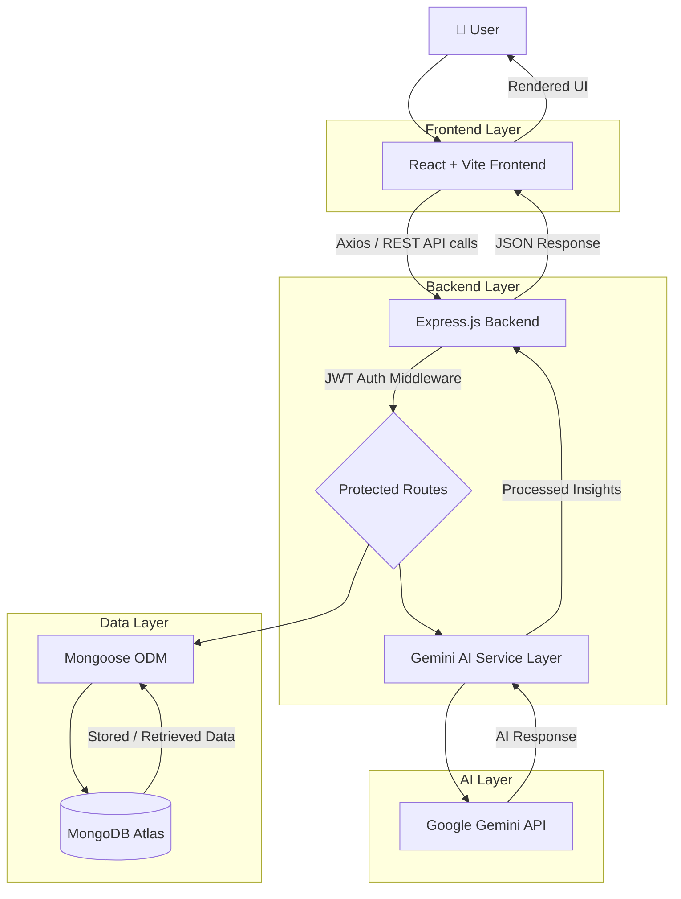

<div align="center">

# 🚀 PrepPilot

### AI-Powered Interview Preparation Platform

**Your co-pilot for cracking software engineering interviews — powered by AI, built for students.**

[](https://react.dev/)
[](https://nodejs.org/)
[](https://www.mongodb.com/atlas)
[](https://ai.google.dev/)
[](https://vercel.com/)
[](https://render.com/)
[](#-license)

[](https://github.com/adarshsingh31/PrepPilot/stargazers)
[](https://github.com/adarshsingh31/PrepPilot/network/members)
[](https://github.com/adarshsingh31/PrepPilot/issues)
[](https://github.com/adarshsingh31/PrepPilot/commits/main)

PrepPilot is a full-stack, AI-driven interview preparation ecosystem that combines **mock interviews**, **resume analysis**, **coding practice**, **personalized study plans**, and **deep analytics** into one seamless platform — helping students go from *"I don't know where to start"* to *"I'm interview-ready."*

<p align="center">
  <a href="https://prep-pilot-beta.vercel.app"><strong>🌐 Live Demo</strong></a>
  ·
  <a href="https://github.com/adarshsingh31/PrepPilot"><strong>📦 GitHub Repository</strong></a>
  ·
  <a href="#-installation-guide"><strong>⚙️ Installation Guide</strong></a>
  ·
  <a href="#-support"><strong>⭐ Star this Repo</strong></a>
</p>

</div>

<br/>

<div align="center">
  <a href="https://prep-pilot-beta.vercel.app">
    
  </a>
  &nbsp;&nbsp;
  <a href="https://github.com/adarshsingh31/PrepPilot">
    
  </a>
</div>

<br/>

---

## 📚 Table of Contents

- [🎯 Project Overview](#-project-overview)
- [✨ Key Features](#-key-features)
- [🖼️ Screenshots](#️-screenshots)
- [🛠️ Tech Stack](#️-tech-stack)
- [🏗️ System Architecture](#️-system-architecture)
- [📁 Folder Structure](#-folder-structure)
- [⚙️ Installation Guide](#-installation-guide)
- [🔐 Environment Variables](#-environment-variables)
- [📡 API Overview](#-api-overview)
- [🔄 Project Workflow](#-project-workflow)
- [🚧 Future Improvements](#-future-improvements)
- [⚡ Performance Optimizations](#-performance-optimizations)
- [☁️ Deployment](#️-deployment)
- [🤝 Contributing](#-contributing)
- [📄 License](#-license)
- [👨‍💻 Author](#-author)
- [💬 Support](#-support)

---

## 🎯 Project Overview

Landing a software engineering job is not just about knowing how to code — it's about **structured preparation**: technical interviews, resume optimization, behavioral rounds, and consistent practice. Most students juggle five different tools (LeetCode for DSA, a resume checker, YouTube for mock interviews, a spreadsheet for tracking progress, and Notion for study plans) with no single source of truth.

**PrepPilot solves this fragmentation.**

It is a unified, AI-powered platform that brings every stage of interview preparation — from **resume review** to **live mock interviews** to **coding practice** to **progress analytics** — under one roof, powered by the **Google Gemini API** for intelligent, human-like feedback.

### The Problem

- 📌 Students prepare in silos — no centralized tracking of technical + interview readiness.
- 📌 Manual resume review is slow, subjective, and inaccessible to many.
- 📌 Mock interviews with peers/mentors are hard to schedule and inconsistent in quality.
- 📌 Generic coding platforms don't map directly to interview-specific, company-specific prep.
- 📌 Without analytics, students can't tell if they're actually improving.

### The Solution

PrepPilot delivers **AI-generated mock interviews** with real-time evaluation, **AI resume analysis** with actionable feedback, a **curated question bank** filtered by company/topic/difficulty, a **personalized study roadmap**, and **rich analytics** — all wrapped in a clean, modern, distraction-free UI.

### Who Is It For?

| Audience | How PrepPilot Helps |
|---|---|
| 🎓 **Students & New Grads** | Structured prep for their first SDE role with guided roadmaps |
| 💼 **Job Switchers** | Sharpen interview skills and resume before applying to new companies |
| 🧑‍🏫 **Bootcamp Graduates** | Bridge the gap between coursework and real interview expectations |
| 🏢 **Placement Cells / Colleges** | A single platform to track and mentor students at scale |

---

## ✨ Key Features

### 🔐 Authentication & Onboarding

| Feature | Description |
|---|---|
| **Signup** | Secure account creation with validation |
| **Login** | JWT-based session authentication |
| **OTP Verification** | Email-based OTP for verified account creation |
| **Forgot Password** | Self-service password recovery flow |
| **Reset Password** | Secure token-based password reset |

### 🏠 Dashboard

| Feature | Description |
|---|---|
| **Personalized Dashboard** | At-a-glance summary tailored to the logged-in user |
| **Performance Overview** | Snapshot of interview scores, resume score, and coding progress |
| **Statistics** | Key numbers — interviews taken, questions solved, streaks |
| **Quick Access** | One-click navigation to all core modules |

### 🤖 AI Mock Interview

| Feature | Description |
|---|---|
| **AI-Generated Questions** | Dynamically generated based on domain and difficulty |
| **Domain Selection** | Choose from DSA, System Design, HR, Behavioral, and more |
| **Difficulty Selection** | Easy / Medium / Hard tiers |
| **Interview Timer** | Real-time countdown to simulate interview pressure |
| **AI Answer Evaluation** | Gemini-powered scoring and qualitative feedback |
| **AI Interview Report** | Detailed breakdown of strengths and improvement areas |
| **Interview History** | Access all past interview sessions |
| **Performance Analytics** | Track score trends across sessions |

### 📄 Resume Analyzer

| Feature | Description |
|---|---|
| **PDF Upload** | Drag-and-drop resume upload |
| **AI Resume Analysis** | Gemini-powered parsing and evaluation |
| **Resume Score** | Quantified score out of 100 |
| **Strengths** | AI-highlighted strong points |
| **Weaknesses** | AI-identified gaps and red flags |
| **Suggestions** | Actionable, line-item improvement tips |

### 💻 Coding Practice

| Feature | Description |
|---|---|
| **Practice Questions** | Curated DSA and problem-solving questions |
| **Topic Filtering** | Filter by Arrays, Trees, DP, Graphs, etc. |
| **Difficulty Filtering** | Easy / Medium / Hard |
| **Progress Tracking** | Mark questions as solved/attempted |

### 🏦 Question Bank

| Feature | Description |
|---|---|
| **Company Questions** | Real questions tagged by company (FAANG, product-based, etc.) |
| **Topic Filters** | Narrow down by subject area |
| **Difficulty Filters** | Sort by complexity |
| **Importance Filters** | Focus on high-frequency, high-weightage questions |
| **Search** | Instant keyword-based question lookup |

### 🗺️ Study Plan

| Feature | Description |
|---|---|
| **Personalized Roadmap** | AI/rule-based plan tailored to the user's goals |
| **Task Completion** | Checklist-driven daily/weekly tasks |
| **Progress Tracking** | Visual completion percentage |

### 📈 Progress & Analytics

| Feature | Description |
|---|---|
| **Weekly Analytics** | Week-over-week performance summary |
| **Monthly Analytics** | Long-term trend visualization |
| **Graphs** | Visual charts for scores, activity, and consistency |
| **Streak** | Daily practice streak tracker |
| **Milestones** | Achievement badges for key progress markers |

### 👤 Profile

| Feature | Description |
|---|---|
| **Edit Profile** | Update personal info and preferences |
| **Achievements** | Earned badges and milestones |
| **Statistics** | Personal performance summary |

### 🔍 Global Search & Help

| Feature | Description |
|---|---|
| **Global Search** | Search across interviews, questions, and resources app-wide |
| **FAQ** | Common questions answered |
| **About PrepPilot** | Platform mission and background |
| **Contact Developer** | Direct line to the maintainer |

---

## 🖼️ Screenshots

<div align="center">

A closer look at PrepPilot's core modules — from the landing experience to AI-driven interview reports.

<table>
<tr>
<td align="center" width="25%">
<div style="border:1px solid #d0d7de; border-radius:12px; overflow:hidden; box-shadow:0 4px 14px rgba(0,0,0,0.10);">
<div style="background:#e9ebee; padding:6px 10px; display:flex; align-items:center; gap:6px; border-bottom:1px solid #d0d7de;">
<span style="height:10px; width:10px; border-radius:50%; background:#ff5f56; display:inline-block;"></span>
<span style="height:10px; width:10px; border-radius:50%; background:#ffbd2e; display:inline-block;"></span>
<span style="height:10px; width:10px; border-radius:50%; background:#27c93f; display:inline-block;"></span>
</div>

</div>
<br/>
<sub><b>🏠 Landing Page</b></sub>
</td>
<td align="center" width="25%">
<div style="border:1px solid #d0d7de; border-radius:12px; overflow:hidden; box-shadow:0 4px 14px rgba(0,0,0,0.10);">
<div style="background:#e9ebee; padding:6px 10px; display:flex; align-items:center; gap:6px; border-bottom:1px solid #d0d7de;">
<span style="height:10px; width:10px; border-radius:50%; background:#ff5f56; display:inline-block;"></span>
<span style="height:10px; width:10px; border-radius:50%; background:#ffbd2e; display:inline-block;"></span>
<span style="height:10px; width:10px; border-radius:50%; background:#27c93f; display:inline-block;"></span>
</div>

</div>
<br/>
<sub><b>📊 Dashboard</b></sub>
</td>
<td align="center" width="25%">
<div style="border:1px solid #d0d7de; border-radius:12px; overflow:hidden; box-shadow:0 4px 14px rgba(0,0,0,0.10);">
<div style="background:#e9ebee; padding:6px 10px; display:flex; align-items:center; gap:6px; border-bottom:1px solid #d0d7de;">
<span style="height:10px; width:10px; border-radius:50%; background:#ff5f56; display:inline-block;"></span>
<span style="height:10px; width:10px; border-radius:50%; background:#ffbd2e; display:inline-block;"></span>
<span style="height:10px; width:10px; border-radius:50%; background:#27c93f; display:inline-block;"></span>
</div>

</div>
<br/>
<sub><b>🤖 AI Mock Interview</b></sub>
</td>
<td align="center" width="25%">
<div style="border:1px solid #d0d7de; border-radius:12px; overflow:hidden; box-shadow:0 4px 14px rgba(0,0,0,0.10);">
<div style="background:#e9ebee; padding:6px 10px; display:flex; align-items:center; gap:6px; border-bottom:1px solid #d0d7de;">
<span style="height:10px; width:10px; border-radius:50%; background:#ff5f56; display:inline-block;"></span>
<span style="height:10px; width:10px; border-radius:50%; background:#ffbd2e; display:inline-block;"></span>
<span style="height:10px; width:10px; border-radius:50%; background:#27c93f; display:inline-block;"></span>
</div>

</div>
<br/>
<sub><b>📄 Resume Analyzer</b></sub>
</td>
</tr>
</table>

<br/>

<table>
<tr>
<td align="center" width="25%">
<div style="border:1px solid #d0d7de; border-radius:12px; overflow:hidden; box-shadow:0 4px 14px rgba(0,0,0,0.10);">
<div style="background:#e9ebee; padding:6px 10px; display:flex; align-items:center; gap:6px; border-bottom:1px solid #d0d7de;">
<span style="height:10px; width:10px; border-radius:50%; background:#ff5f56; display:inline-block;"></span>
<span style="height:10px; width:10px; border-radius:50%; background:#ffbd2e; display:inline-block;"></span>
<span style="height:10px; width:10px; border-radius:50%; background:#27c93f; display:inline-block;"></span>
</div>

</div>
<br/>
<sub><b>💻 Coding Practice</b></sub>
</td>
<td align="center" width="25%">
<div style="border:1px solid #d0d7de; border-radius:12px; overflow:hidden; box-shadow:0 4px 14px rgba(0,0,0,0.10);">
<div style="background:#e9ebee; padding:6px 10px; display:flex; align-items:center; gap:6px; border-bottom:1px solid #d0d7de;">
<span style="height:10px; width:10px; border-radius:50%; background:#ff5f56; display:inline-block;"></span>
<span style="height:10px; width:10px; border-radius:50%; background:#ffbd2e; display:inline-block;"></span>
<span style="height:10px; width:10px; border-radius:50%; background:#27c93f; display:inline-block;"></span>
</div>

</div>
<br/>
<sub><b>🏦 Question Bank</b></sub>
</td>
<td align="center" width="25%">
<div style="border:1px solid #d0d7de; border-radius:12px; overflow:hidden; box-shadow:0 4px 14px rgba(0,0,0,0.10);">
<div style="background:#e9ebee; padding:6px 10px; display:flex; align-items:center; gap:6px; border-bottom:1px solid #d0d7de;">
<span style="height:10px; width:10px; border-radius:50%; background:#ff5f56; display:inline-block;"></span>
<span style="height:10px; width:10px; border-radius:50%; background:#ffbd2e; display:inline-block;"></span>
<span style="height:10px; width:10px; border-radius:50%; background:#27c93f; display:inline-block;"></span>
</div>

</div>
<br/>
<sub><b>🗺️ Study Plan</b></sub>
</td>
<td align="center" width="25%">
<div style="border:1px solid #d0d7de; border-radius:12px; overflow:hidden; box-shadow:0 4px 14px rgba(0,0,0,0.10);">
<div style="background:#e9ebee; padding:6px 10px; display:flex; align-items:center; gap:6px; border-bottom:1px solid #d0d7de;">
<span style="height:10px; width:10px; border-radius:50%; background:#ff5f56; display:inline-block;"></span>
<span style="height:10px; width:10px; border-radius:50%; background:#ffbd2e; display:inline-block;"></span>
<span style="height:10px; width:10px; border-radius:50%; background:#27c93f; display:inline-block;"></span>
</div>

</div>
<br/>
<sub><b>📈 Progress & Analytics</b></sub>
</td>
</tr>
</table>

<br/>

<table>
<tr>
<td align="center" width="25%">
<div style="border:1px solid #d0d7de; border-radius:12px; overflow:hidden; box-shadow:0 4px 14px rgba(0,0,0,0.10);">
<div style="background:#e9ebee; padding:6px 10px; display:flex; align-items:center; gap:6px; border-bottom:1px solid #d0d7de;">
<span style="height:10px; width:10px; border-radius:50%; background:#ff5f56; display:inline-block;"></span>
<span style="height:10px; width:10px; border-radius:50%; background:#ffbd2e; display:inline-block;"></span>
<span style="height:10px; width:10px; border-radius:50%; background:#27c93f; display:inline-block;"></span>
</div>

</div>
<br/>
<sub><b>👤 Profile</b></sub>
</td>
<td align="center" width="25%">
<div style="border:1px solid #d0d7de; border-radius:12px; overflow:hidden; box-shadow:0 4px 14px rgba(0,0,0,0.10);">
<div style="background:#e9ebee; padding:6px 10px; display:flex; align-items:center; gap:6px; border-bottom:1px solid #d0d7de;">
<span style="height:10px; width:10px; border-radius:50%; background:#ff5f56; display:inline-block;"></span>
<span style="height:10px; width:10px; border-radius:50%; background:#ffbd2e; display:inline-block;"></span>
<span style="height:10px; width:10px; border-radius:50%; background:#27c93f; display:inline-block;"></span>
</div>

</div>
<br/>
<sub><b>⚙️ Settings</b></sub>
</td>
<td align="center" width="25%">
<div style="border:1px solid #d0d7de; border-radius:12px; overflow:hidden; box-shadow:0 4px 14px rgba(0,0,0,0.10);">
<div style="background:#e9ebee; padding:6px 10px; display:flex; align-items:center; gap:6px; border-bottom:1px solid #d0d7de;">
<span style="height:10px; width:10px; border-radius:50%; background:#ff5f56; display:inline-block;"></span>
<span style="height:10px; width:10px; border-radius:50%; background:#ffbd2e; display:inline-block;"></span>
<span style="height:10px; width:10px; border-radius:50%; background:#27c93f; display:inline-block;"></span>
</div>

</div>
<br/>
<sub><b>❓ Help Center</b></sub>
</td>
<td align="center" width="25%">
&nbsp;
</td>
</tr>
</table>

</div>

> 💡 *All screenshots live in the `/screenshots` directory of this repository. GitHub's markdown sanitizer may strip some inline styles (border-radius/shadow) on the rendered repo page — the gallery degrades gracefully to clean, evenly-sized images in that case, and renders fully styled in browsers/editors that preserve inline CSS.*

---

## 🛠️ Tech Stack

### Frontend

| Technology | Purpose |
|---|---|
| **React** | Component-based UI library |
| **Vite** | Lightning-fast build tool and dev server |
| **React Router** | Client-side routing and navigation |
| **Axios** | Promise-based HTTP client for API calls |
| **Tailwind CSS** | Utility-first CSS framework for rapid styling |

### Backend

| Technology | Purpose |
|---|---|
| **Node.js** | JavaScript runtime for the server |
| **Express.js** | Minimal and flexible web framework |
| **JWT Authentication** | Stateless, secure user session management |

### Database

| Technology | Purpose |
|---|---|
| **MongoDB Atlas** | Cloud-hosted NoSQL database |
| **Mongoose** | Elegant ODM for MongoDB and Node.js |

### AI

| Technology | Purpose |
|---|---|
| **Google Gemini API** | Powers mock interview generation, evaluation, and resume analysis |

### Deployment

| Technology | Purpose |
|---|---|
| **Vercel** | Frontend hosting with CI/CD |
| **Render** | Backend hosting and API deployment |

---

## 🏗️ System Architecture

PrepPilot follows a clean **client–server–AI** architecture. The React frontend communicates with the Express backend via REST APIs, the backend persists data in MongoDB Atlas, and delegates all intelligence tasks (question generation, evaluation, resume analysis) to the Google Gemini API.



### Request Flow

1. **User Interaction** — User performs an action (e.g., starts a mock interview) on the React frontend.
2. **API Request** — Axios sends an authenticated REST request to the Express backend.
3. **Auth Middleware** — JWT middleware validates the token before granting access to protected routes.
4. **Business Logic** — Controllers process the request; if AI is required, the request is routed to the Gemini service layer.
5. **AI Processing** — The Gemini API generates questions, evaluates answers, or analyzes resumes.
6. **Persistence** — Mongoose writes/reads relevant data to/from MongoDB Atlas.
7. **Response** — The backend returns a structured JSON response, which the frontend renders in real time.

---

## 📁 Folder Structure

```
PrepPilot/
├── client/                         # Frontend (React + Vite)
│   ├── public/
│   │   └── favicon.ico
│   ├── src/
│   │   ├── assets/                 # Images, icons, static assets
│   │   ├── components/             # Reusable UI components
│   │   │   ├── common/             # Buttons, inputs, modals, loaders
│   │   │   ├── layout/             # Navbar, Sidebar, Footer
│   │   │   └── charts/             # Analytics chart components
│   │   ├── pages/                  # Route-level page components
│   │   │   ├── Landing/
│   │   │   ├── Auth/                # Login, Signup, OTP, Reset
│   │   │   ├── Dashboard/
│   │   │   ├── MockInterview/
│   │   │   ├── ResumeAnalyzer/
│   │   │   ├── CodingPractice/
│   │   │   ├── QuestionBank/
│   │   │   ├── StudyPlan/
│   │   │   ├── Progress/
│   │   │   ├── Profile/
│   │   │   └── Help/
│   │   ├── context/                 # React Context providers (Auth, Theme)
│   │   ├── hooks/                   # Custom React hooks
│   │   ├── services/                # Axios API service modules
│   │   ├── utils/                   # Helper functions
│   │   ├── routes/                  # React Router route definitions
│   │   ├── App.jsx
│   │   └── main.jsx
│   ├── .env
│   ├── index.html
│   ├── tailwind.config.js
│   ├── vite.config.js
│   └── package.json
│
├── server/                          # Backend (Node.js + Express)
│   ├── config/
│   │   ├── db.js                    # MongoDB connection
│   │   └── gemini.js                # Gemini API client setup
│   ├── controllers/
│   │   ├── authController.js
│   │   ├── interviewController.js
│   │   ├── resumeController.js
│   │   ├── questionController.js
│   │   ├── studyPlanController.js
│   │   └── analyticsController.js
│   ├── middleware/
│   │   ├── authMiddleware.js
│   │   ├── errorHandler.js
│   │   └── uploadMiddleware.js
│   ├── models/
│   │   ├── User.js
│   │   ├── Interview.js
│   │   ├── Resume.js
│   │   ├── Question.js
│   │   ├── StudyPlan.js
│   │   └── Progress.js
│   ├── routes/
│   │   ├── authRoutes.js
│   │   ├── interviewRoutes.js
│   │   ├── resumeRoutes.js
│   │   ├── questionRoutes.js
│   │   ├── studyPlanRoutes.js
│   │   └── analyticsRoutes.js
│   ├── services/
│   │   ├── geminiService.js          # AI prompt & response handling
│   │   └── emailService.js           # OTP / password reset emails
│   ├── utils/
│   │   ├── generateToken.js
│   │   └── validators.js
│   ├── .env
│   ├── server.js
│   └── package.json
│
├── screenshots/                      # README image assets
├── .gitignore
├── LICENSE
└── README.md
```

---

## ⚙️ Installation Guide

### Prerequisites

- **Node.js** v18 or higher
- **npm** or **yarn**
- A **MongoDB Atlas** account and connection string
- A **Google Gemini API** key

### 1️⃣ Clone the Repository

```bash
git clone https://github.com/adarshsingh31/PrepPilot.git
cd PrepPilot
```

### 2️⃣ Backend Setup

```bash
cd server
npm install
```

Create a `.env` file inside `server/` (see [Environment Variables](#-environment-variables) below), then start the server:

```bash
npm run dev
```

The backend will run on `http://localhost:5000` by default.

### 3️⃣ Frontend Setup

```bash
cd client
npm install
```

Create a `.env` file inside `client/` (see [Environment Variables](#-environment-variables) below), then start the dev server:

```bash
npm run dev
```

The frontend will run on `http://localhost:5173` by default.

### 4️⃣ Run the Full Project Locally

Open two terminal windows:

```bash
# Terminal 1 — Backend
cd server && npm run dev

# Terminal 2 — Frontend
cd client && npm run dev
```

Then visit **`http://localhost:5173`** in your browser. 🎉

---

## 🔐 Environment Variables

### Backend (`server/.env`)

| Variable | Description |
|---|---|
| `PORT` | Port on which the Express server runs (e.g., `5000`) |
| `MONGO_URI` | MongoDB Atlas connection string |
| `JWT_SECRET` | Secret key used to sign and verify JWT tokens |
| `JWT_EXPIRES_IN` | Token expiry duration (e.g., `7d`) |
| `GEMINI_API_KEY` | API key for Google Gemini AI integration |
| `EMAIL_HOST` | SMTP host used for sending OTP/reset emails |
| `EMAIL_PORT` | SMTP port |
| `EMAIL_USER` | SMTP account username/email |
| `EMAIL_PASS` | SMTP account password/app-password |
| `CLIENT_URL` | Deployed/local frontend URL, used for CORS and email links |

### Frontend (`client/.env`)

| Variable | Description |
|---|---|
| `VITE_API_BASE_URL` | Base URL of the backend API (e.g., `http://localhost:5000/api`) |
| `VITE_APP_NAME` | Display name of the application |

> ⚠️ **Never commit your `.env` files.** Both are already included in `.gitignore`.

---

## 📡 API Overview

<details>
<summary><strong>🔑 Authentication APIs</strong></summary>

| Method | Endpoint | Description |
|---|---|---|
| `POST` | `/api/auth/signup` | Register a new user |
| `POST` | `/api/auth/login` | Authenticate user and issue JWT |
| `POST` | `/api/auth/send-otp` | Send OTP for email verification |
| `POST` | `/api/auth/verify-otp` | Verify submitted OTP |
| `POST` | `/api/auth/forgot-password` | Trigger password reset email |
| `POST` | `/api/auth/reset-password` | Reset password using token |

</details>

<details>
<summary><strong>🤖 Interview APIs</strong></summary>

| Method | Endpoint | Description |
|---|---|---|
| `POST` | `/api/interview/start` | Start a new AI mock interview session |
| `POST` | `/api/interview/submit-answer` | Submit an answer for AI evaluation |
| `GET` | `/api/interview/report/:id` | Fetch AI-generated interview report |
| `GET` | `/api/interview/history` | Get user's past interview sessions |

</details>

<details>
<summary><strong>📄 Resume APIs</strong></summary>

| Method | Endpoint | Description |
|---|---|---|
| `POST` | `/api/resume/upload` | Upload resume PDF for analysis |
| `GET` | `/api/resume/analysis/:id` | Retrieve AI resume analysis result |
| `GET` | `/api/resume/history` | Get past resume analyses |

</details>

<details>
<summary><strong>❓ Question APIs</strong></summary>

| Method | Endpoint | Description |
|---|---|---|
| `GET` | `/api/questions` | Fetch questions with filters (topic, difficulty, company) |
| `GET` | `/api/questions/:id` | Get a single question's details |
| `PATCH` | `/api/questions/:id/progress` | Update solved/attempted status |

</details>

<details>
<summary><strong>📊 Analytics APIs</strong></summary>

| Method | Endpoint | Description |
|---|---|---|
| `GET` | `/api/analytics/weekly` | Fetch weekly performance analytics |
| `GET` | `/api/analytics/monthly` | Fetch monthly performance analytics |
| `GET` | `/api/analytics/streak` | Get current practice streak |

</details>

<details>
<summary><strong>🗺️ Study Plan APIs</strong></summary>

| Method | Endpoint | Description |
|---|---|---|
| `GET` | `/api/study-plan` | Fetch user's personalized roadmap |
| `PATCH` | `/api/study-plan/:taskId/complete` | Mark a study task as complete |

</details>

<details>
<summary><strong>🔍 Search APIs</strong></summary>

| Method | Endpoint | Description |
|---|---|---|
| `GET` | `/api/search?q=` | Global search across questions, interviews, and resources |

</details>

---

## 🔄 Project Workflow

1. **Sign Up & Verify** — New users register, verify their email via OTP, and log in securely.
2. **Land on Dashboard** — Users see a personalized overview of their progress and quick links to every module.
3. **Upload Resume** — Users upload their resume for instant AI analysis, scoring, and suggestions.
4. **Take a Mock Interview** — Users select a domain and difficulty, take a timed AI-driven interview, and receive a detailed evaluation report.
5. **Practice Coding** — Users solve curated problems filtered by topic/difficulty and track completion.
6. **Explore Question Bank** — Users prep with company-specific, high-importance questions.
7. **Follow Study Plan** — Users follow a personalized roadmap with daily/weekly tasks.
8. **Track Progress** — Users monitor weekly/monthly analytics, streaks, and milestones.
9. **Iterate** — Users repeat interviews and practice sessions, watching their scores improve over time.

---

## 🚧 Future Improvements

- 🎙️ **Voice AI Interviews** — Conduct mock interviews via real-time voice interaction
- 🎥 **Video Interviews** — Record and analyze body language and delivery
- 🔐 **Google Login** — One-click OAuth-based sign-in
- 🔐 **GitHub Login** — OAuth sign-in for developers
- 🏆 **Leaderboard** — Competitive rankings among peers
- 🏢 **Company-Specific Interview Sets** — Tailored mock interviews per target company
- 🧠 **AI Coding Mentor** — Real-time hints and code review during practice
- 📤 **Export Reports** — Download interview and resume reports as PDF

---

## ⚡ Performance Optimizations

- **Lazy Loading** — Route-based code splitting for faster initial page loads
- **JWT Authentication** — Stateless, scalable session management without server-side session storage
- **REST APIs** — Clean, predictable, cacheable API design
- **Optimized MongoDB Queries** — Indexed fields and lean queries to minimize latency
- **Reusable Components** — DRY, modular React components across the frontend
- **Environment Variables** — Configuration separated from code for security and portability

---

## ☁️ Deployment

| Layer | Platform | Notes |
|---|---|---|
| **Frontend** | [Vercel](https://vercel.com/) | Auto-deployed from `main` branch with CI/CD |
| **Backend** | [Render](https://render.com/) | Node.js web service with auto-restart on push |
| **Database** | [MongoDB Atlas](https://www.mongodb.com/atlas) | Fully managed, cloud-hosted cluster |

🔗 **Live Application:** [prep-pilot-beta.vercel.app](https://prep-pilot-beta.vercel.app)

---

## 🤝 Contributing

Contributions are what make the open-source community such an incredible place to learn and build. Any contributions you make are **greatly appreciated**.

1. **Fork** the repository
2. **Create your feature branch**
   ```bash
   git checkout -b feature/AmazingFeature
   ```
3. **Commit your changes**
   ```bash
   git commit -m "Add: AmazingFeature"
   ```
4. **Push to the branch**
   ```bash
   git push origin feature/AmazingFeature
   ```
5. **Open a Pull Request**

Please make sure to update tests and documentation as appropriate.

---

## 📄 License

This project is licensed under the **MIT License** — see the [LICENSE](./LICENSE) file for details.

```
MIT License

Copyright (c) 2026 Adarsh Singh

Permission is hereby granted, free of charge, to any person obtaining a copy
of this software and associated documentation files, to deal in the Software
without restriction, including without limitation the rights to use, copy,
modify, merge, publish, distribute, sublicense, and/or sell copies of the
Software, subject to the following conditions: the above copyright notice
and this permission notice shall be included in all copies or substantial
portions of the Software.
```

---

## 👨‍💻 Author

<div align="center">

### Adarsh Singh

[](https://github.com/adarshsingh31)
[](https://www.linkedin.com/in/adarsh-singh-936380341)
[](mailto:adarshsingh1618@gmail.com)

</div>

---

## 💬 Support

If **PrepPilot** helped you or inspired your own project, please consider:

- ⭐ **Starring this repository** to show your support
- 🐛 **Reporting bugs** via [GitHub Issues](https://github.com/adarshsingh31/PrepPilot/issues)
- 🔀 **Contributing** new features or improvements
- 📢 **Sharing** it with fellow students preparing for interviews

<div align="center">

### If you found this project useful, don't forget to give it a ⭐!

</div>

---

<div align="center">

**Built with ❤️ and ☕ by [Adarsh Singh](https://github.com/adarshsingh31)**

*Empowering the next generation of software engineers, one mock interview at a time.*

[](https://react.dev/)
[](https://ai.google.dev/)

</div>
